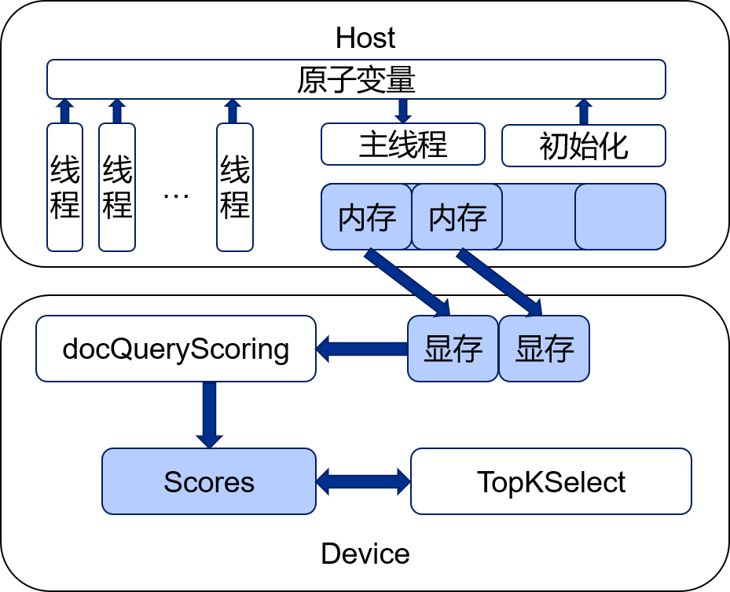
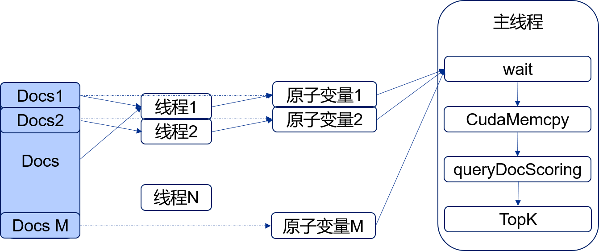
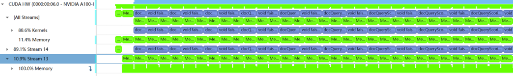
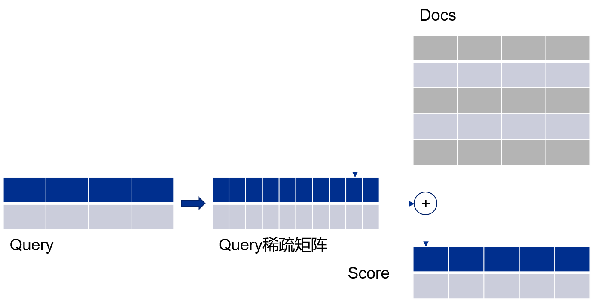
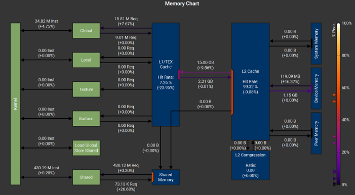
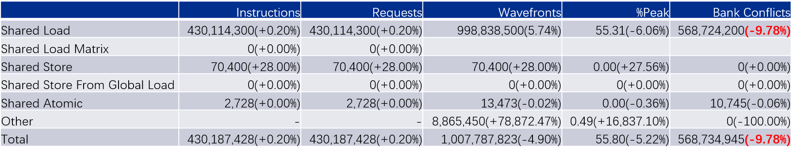
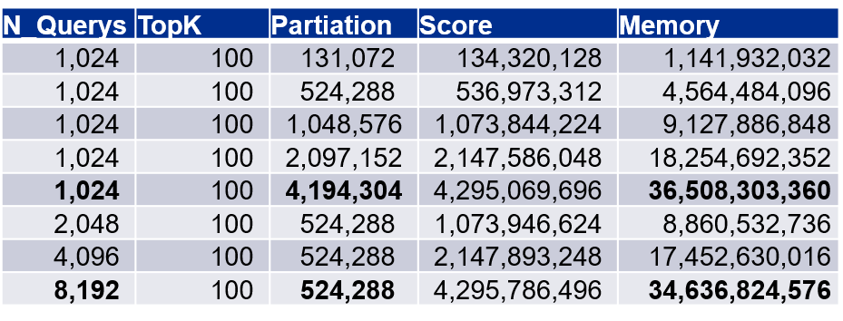
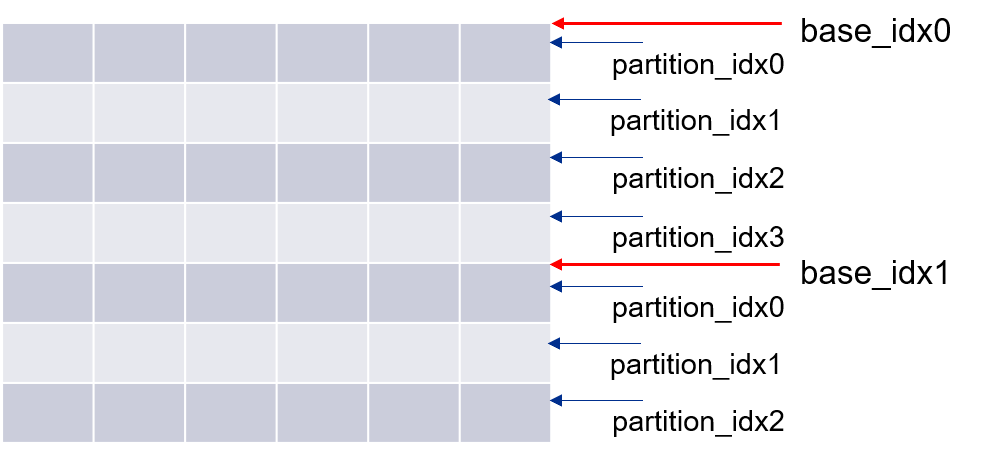
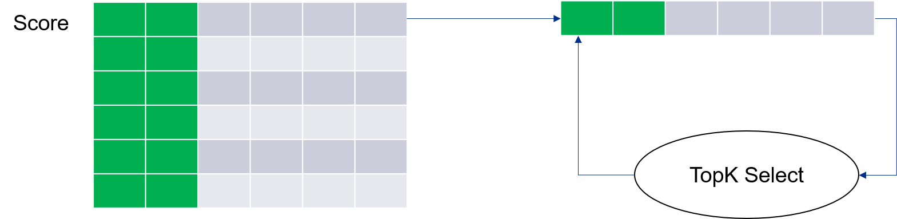
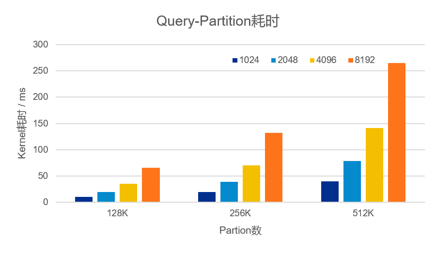

# 基于向量交集的万亿级文档搜索方案

## 任务描述
给定850万条规模的数据文件，每条数据是最大128维度的整型id向量 （称为doc），id取值范围是0-50000，给定一个最大128维的整型id向量（称为query），求query与doc全集内各数据的交集个数topk（k=100）。

## 方案设计

针对任务，设计了流水线并行处理方案，通过各种技术，最终方案可以支持2^44个Doc，实现万亿文档搜索。

方案使用的主要技术如下。

- 多线程并行：多线程处理doc数据。
- 原子同步：多线程处理完doc之后，设置原子变量标志位。
- 异构并行：Host多线程处理数据，主线程Copy数据到GPU，GPU计算Query得分并排序，三者并行。
- Kernel稀疏计算：将query转换成bit表示的矩阵，“值比较计算”转换成“读取累加”过程。
- Score融合表示：使用UInt64表示得分，将doc索引融合进得分中。
- Doc分块：显著减少GPU显存占用，L2 cache命中达99.9%。
- TopK片上规约：多次规约获取TopK，减少显存占用。

本次实现的详细代码见：

  
  
整体流程

## 多线程并行
- Docs数据量大：Doc数据量可能很大，超过百亿，需要多线程并行处理。
- 多线程并行：N个线程，处理M块Doc。
- 原子操作同步：轻量，不需要信号量，线程同步简单。

  
  
多线程处理流程

### 异构并行
CPU与GPU异构系统，使用多Stream技术，实现同步执行。

CPU处理数据，并把数据Copy到GPU。同时，GPU计算Query得分、排序。
- 多Stream并行：2个Stream，Memcpy、Kernel计算使用不同Stream，可同时进行。
- 数据处理、Memcpy、Kernel计算并行

CPU、GPU并行结果如下，Nsight System中看到，2个Steam分别执行Memcpy和Kernel计算。另外，CPU在同时处理数据。 

  
  
异构并行

### 稀疏计算
文档搜索任务的id取值范围是0-50000，而单个条目最大只有128维。使用矩阵表示单个条目，是非常稀疏的矩阵。同时，向量交集需要判断数据是否相等。通过将Query转换成稀疏矩阵表示，把Doc作为矩阵索引，避免了数据的直接比较。以此为核心，设计实现了计算得分的GPU kernel。
- 向量交集任务，避免数据相等比较
- Query数据使用Bit稀疏矩阵表示
- Doc数据作为索引
- 累加Doc索引结果
- 得分计算方法

  
  
得分计算方法

在实际的Kernel计算时，使用Nsight Compute分析了显存访问。遇到问题Shared Memory Bank Conflicts过高的问题，通过使用Register暂存Shared Memory内容减少了10%左右的Bank Conflicts。

  
  
Nsight Compute显存分析

  
  
Bank Conflicts优化结果

### 显存分析
在实际计算中，分析显存占用发现，Score占用了过多的显存，显存占用计算公式如下。公式中使用uint64存储得分，uint16存储query和doc。DimItem是数据维度，最大128。

$$ Mem = N_q*(M_{part}+TopK)*sizeof(uint64)+ (N_q+2*M_{part})*DimItem*sizeof(uint16) $$

显存占用有如下特点。通过doc分块，使用乒乓显存技术，可以极大的降低显存需求，提高L2 Cahce命中。
- 实际应用：N << M。
- 乒乓显存，缓存Docs，流水计算。
- 对Docs分块处理，显著降低显存占用。

  
  
Query-Doc分块的显存占用

### Score融合表示 - 万亿文档支持
在得分相同的情况，如何将索引小的Doc放在前面？目前，大部分TopK算法只能找到前TopK个值，而不能保证索引是最小的。将索引融入得分中，再进行TopK筛选，可以同时获得得分和索引，并可以保证索引是最小的。
使用64bit表示得分，其中高20bit存储真实得分*1e6，1e6保证了得分可以有高度的可区分性。得分低44bit表示doc序号，可以支持2^44个doc，实现万亿文档搜索。
- Score表示：FP16 - E5F10, FP32 - E8F24, UINT64
- 64 bit：20 bit - doc score， 44 bit - doc 序号
- Doc score： match_num * 1000000 / max( query_len, doc_len )
- Doc 序号：base_idx + partition_idx

  
  
Score格式

  
  
Doc分块示例

### TopK片上规约
Doc分块处理之后，每次获取到一部分Score，对这部分Score进行TopK选择，并保留结果。当前块结果与下一块Doc的得分一起进行TopK，再次保留结果。循环这一过程，直到所有Doc都进行了TopK，此时TopK结果就是最终的TopK结果。
方案选择了Faiss的BlockSelect算法作为TopK算法，添加了UInt64的支持，修改了算法中的索引操作，支持非连续的输入和输出，最终实现了UInt64的TopK算法。
- TopK保留与规约
- Faiss BlockSelect，支持UInt64比较、去除索引相关操作
- Inplace操作，支持非连续输入输出

  
  
TopK计算过程

### 性能结果
Doc数据来源于真实数据。使用随机Query进行测试。测试了不同Query数、Doc分块数的耗时。
总体来说，耗时呈线性增长规律，而且在运行过程中，GPU完全达到100%利用率。
随机Query + 真实Docs
Docs ：7853052

  
  
耗时结果

## 总结
此次比赛中，设计实现了支持万亿文档搜索的GPU处理方案，通过多线程、异构并行、稀疏计算、得分融合、TopK规约等技术，以低内存、高并行的方式完成万亿文档搜索。
